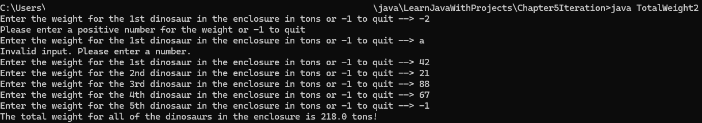

# Total-Weight-Of-Dinosaurs
A program in Java demonstrating conditional statements, iteration, and a little bit of exception handling by asking the user to enter the weight of dinosaurs in an enclosure or -1 to quit.

## Table of contents
* [General Info](#General-info)
* [Author](#Author)
* [Programming Approaches](#Programming-approaches)
* [Techologies](#Technologies)
* [Setup](#Setup)
* [Usage](#Usage)
* [Minimum hardware requirements](#Minimum-hardware-requirements)
* [Screenshots](#Screenshots)
* [Project status](#Project-status)
* [Room for improvement](#Room-for-improvement)
* [Release date](#Release-date)
* [Sources](#Sources)
* [Acknowledgements](#Acknowledgements)
* [Contact](#Contact)

## General info
TotalWeight2.java is a program I wrote in Java as a solution to Exercise 4 in Chapter 5 of the book Learn Java with Projects by Dr. Sean Kennedy and Maaike van Putten. The exercise just wanted you to write a for loop to calculate the total weight of all dinosaurs in an enclosure, but I decided to improve it by writing the program so that the user could enter any number of weights and -1 to quit the program. It demonstrates the use of conditional statements, iteration, and a bit of exception handling, as it catches the exception if the user does not enter a number and allows the user another try, rather than crashing the program. I'm reviewing Java on my own, and not part of any official course curriculum.

## Author
- Jason Ash, Computer Science Major

## Programming approaches
- I programmed it so that the user can enter -1 to quit the loop, obtain the total of all dinosaur weights entered, and end the program. Perhaps a better way to accomplish this exists, but this seemed like a simple solution.
- Quite a bit of logic in the program was determining the ordinal suffix for the dinosaur number displayed. I copied and pasted that logic from another program that I wrote in my C++ Programming and Methodology I course. Since C++ and Java are similar languages, I only had to change the variable names to fit this program.
- By using ordinal suffixes, I did not have to write a prompt and response before a while loop. Instead, I wrote a do-while loop that runs at least once.
- I commented out some of my original error handling (i.e., if(sc.hasNExtDouble()), and instead I decided to use a try-catch block to handle the exception of a number not being entered.

## Technologies:
I wrote the source code in Notepad in Windows 11, compiled it in the Command Prompt using the javac command, and ran it using the java command.

## Setup
To compile this .java file into Java bytecode, you can use the command line like I did or your favorite IDE of choice.

## Usage
After running the program, enter 0 or a positive number for a dinosaur's weight or -1 to quit. It then displays the sum of all the dinosaur weights entered on the console.

## Minimum hardware requirements
Although I developed this on a fairly recent Windows 11 PC, this program should run comfortably on any working computer with sufficient processing power, RAM, a monitor manufactured within the past 15-20 years, and an Internet connection to download the .java source file. 

## Screenshots

## Project status
Since it satisfies and exceeds the requirements of the Chapter 5 Exercise 4 in this book, I'm releasing my solution on GitHub.

## Room for improvement
- Perhaps there is a more elegant way to terminate the program besides the user entering -1, but it seemed like a solution that applies Ocham's Razor.
- The program should probably not accept 0 for a dinosaur's weight since an animal must have a positive value for its weight, but it seemed harmless to leave it this way.
- I don't know if I need to cast the double into an int to check for valid input, but since I'm used to C++ programming recently, and it is a persnickety language, I thought that I would play it safe by doing so.
- I am also not sure whether sc.close() was needed, but a Google search AI summary had that in it when I was looking up how to do sc.nextDouble() since this book hasn't yet covered that scanner function.

## Release date
26 April, 2026

## Sources
This program is my solution to the Chapter 5 Exercise 4 assignment in the Learn Java with Projects book.

## Acknowledgements
- As mentioned above, the sc.nextDouble() and sc.close() functions were obtained from a Google search AI summary when I looked up how to do nextDouble with Scanner in Java.
- Also, the try-catch block to handle exceptions when a number is not entered, and the program was expecting one, was obtained from a Google AI search summary when I looked up how to handle this exception, since I have not yet read Chapter 11 in this book that covers exception handling. 

## Contact
Jason Ash - wizardofki@gmail.com
